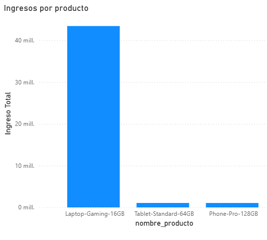
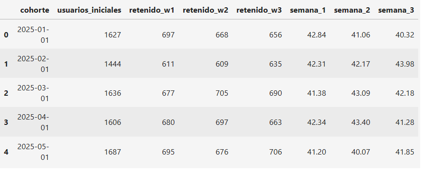
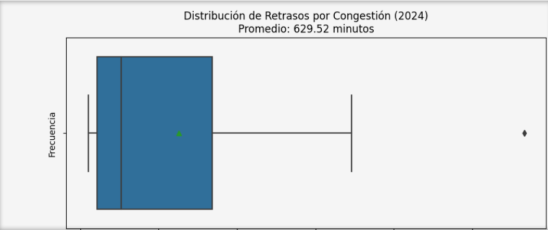
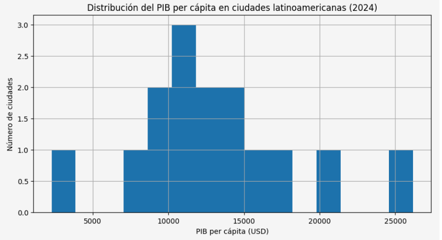
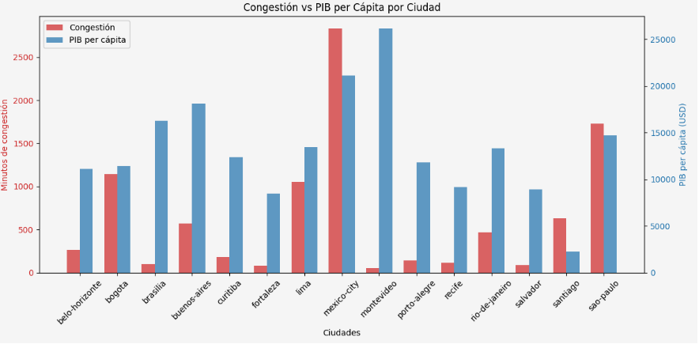

# About Me

Data Analyst with a solid foundation in data analysis and visualization. Proficient in leveraging Python, SQL, and Google Sheets/Excel for advanced data cleaning, analysis, and reporting. Passionate about uncovering patterns in complex raw business datasets and translating them into strategic and actionable insights.

### Tech Stack
- **Languages & Databases:** SQL, Python (Pandas, NumPy), Excel
- **Visualization:** Tableau, Power BI, Seaborn, Matplotlib

#### Professional Core Competencies

* **Performance Metric Tracking:** Skilled at leveraging internal tracking tools to monitor performance metrics, streamline response times, and elevate quality benchmarks.
* **Pattern Recognition & Problem Solving:** Experienced in identifying recurring operational patterns and conducting deep-dive policy research to eliminate process bottlenecks.
* **Executive Reporting & Data Visualization:** Proficient at translating operational data into visual support materials and progress reports for leadership briefings to drive strategic decisions.
* **Business Acumen & Problem Solving:** Translating complex raw dataset patterns into actionable strategic insights and revenue-driven business recommendations.
* **Cross-Functional Communication:** Presenting data-backed findings clearly to non-technical stakeholders and business leadership.
* **Customer-Centric Analytics:** Leveraging domain experience in user feedback, client relations, and operational troubleshooting to identify product and friction drop-offs.
* **Project Management & Execution:** Managing end-to-end analytics project lifecycles from data extraction and cleaning to final report presentation.

#### Connect & Contact

---

# Featured Projects

## Project 1: Comprehensive Strategic Diagnosis for RappiPlus
Evaluated user behavior and unit economics for Rappi's subscription service (RappiPlus) to determine if the loyalty program drives higher purchase frequency and net profitability. By analyzing order history, catalog interactions, and marketing spend, I identified friction points in the conversion funnel and delivered data-backed recommendations to optimize user retention and revenue generation.

#### Tools & Skills

### Key Business Questions
1. Do RappiPlus subscribers actually order more frequently than non-subscribers?
2. Is the subscription model generating sustainable net profit?
3. Are key revenue opportunities being lost during the checkout and purchasing process?

### Methodology
- **Data Cleaning and Validation:** I conducted a thorough quality audit of the datasets—handling missing values, duplicates, schema inconsistencies, and outliers to ensure data integrity before analysis.
- **Business Metric Modeling (KPIs):** I calculated total revenue, cost structures, net profit, Average Order Value (AOV), and unit volumes alongside marketing spend distribution to establish an accurate view of overall unit economics.
- **Conversion Funnel Optimization:** I mapped out the end-to-end user path and pinpointed critical drop-off stages in the purchasing funnel where prospective buyers were exiting.
- **Cohort Retention Analysis:** I built cohort tracking models to analyze user behavior post-registration and track retention rates over time.
- **A/B Testing & Experimentation:** I conducted end-to-end statistical hypothesis testing—selecting appropriate statistical tests and interpreting results to evaluate product changes objectively.

### Key Findings 

#### 1. Data Integrity & Anomaly Detection
> **Critical Operational Finding:** Profitability analysis uncovered a severe outlier—a single order containing **20,000 items**—that artificially inflated average order metrics. This anomaly was flagged to internal teams for fraud and legitimacy verification.

#### 2. Business Model & Regional Profitability
* **Global Profitability:** Overall, the RappiPlus business model is net profitable.
* **Regional Disparities:** Global performance is heavily carried by strong profitability in **Argentina** (driven by top-selling items like the *Laptop Gaming 16GB*). Conversely, operations in **Mexico** and **Colombia** currently generate net losses.

#### 3. Conversion Funnel Bottlenecks
* **Payment Friction:** The checkout funnel suffers a major **~20% drop-off** specifically at the payment stage, where users fail or abandon when attempting to add a payment method.

#### 4. Cohort Retention Dynamics
* **Initial Churn:** User retention drops by **~60%** within the first few days post-onboarding, which aligns with standard digital subscription benchmarks.
* **Long-Term Stability:** Retaining **40% of subscribers** past the initial onboarding window is an exceptionally strong result. Furthermore, retention remains remarkably stable in subsequent weeks, demonstrating solid product-market fit and recurring platform re-engagement.

#### 5. Experimentation & Feature Testing
* **Platform Modification Test:** Statistical hypothesis testing revealed **no statistically significant difference** in conversion rates from the proposed platform modification. Implementing the change is not recommended based on current experimental data.

### Strategic Recommendations

#### 1. Product & Platform Strategy
* **Halt Feature Rollout:** Pause the implementation of the proposed platform changes until further testing demonstrates a statistically significant positive impact on conversion rates.
* **Optimize the Checkout Experience:** Conduct a UX and technical audit on the payment setup flow to resolve the **20% drop-off**. Eliminating payment friction—especially in *Fashion* and *Home* categories—will help stabilize monthly revenue and reduce losses in Mexico and Colombia.

#### 2. Regional Budget & Growth Allocation
* **Reallocate Marketing Spend:** Shift marketing investment toward **Argentina**, where strong profitability actively subsidizes cross-market growth. Scale back acquisition spend in underperforming markets (**Mexico** and **Colombia**) until unit economics improve.

#### 3. Category & Inventory Optimization
* **Streamline Category Focus:** Pivot promotional and inventory resources toward the high-margin **Electronics** category while scaling down spend on lower-margin *Home* and *Fashion* segments.
* **Capitalize on Top Performers:** Prioritize sales and marketing campaigns around the **16GB Gaming Laptop**, identified as the single highest-performing product in the catalog.

### Key Visualizations

**[View Full Repository on GitHub](https://github.com/your-username/project-repo)**

## Project 2: Urban Mobility and Economic Productivity in LATAM Cities
Find out if there is a correlation between transportation structure and PIB in certain cities for the Latin American Development Bank, which wishes to identify which cities to invest in transportation infrastructure to improve productivity and population well-being.

#### Tools & Skills

### Key Business Questions
1. Which cities exhibit severe traffic congestion paired with low economic productivity?
2. Which cities demonstrate the strongest combined indicators—balancing efficient transit mobility with robust economic performance?
3. Which key variables show the strongest correlation with long-term urban and economic development?

### Methodology
- **Data Cleaning and Validation:** Standardized column names and converted data types (including dates and numerical values) across datasets to enable seamless joins and accurate calculations, while filtering records by year to isolate the most recent and relevant data.
- **Exploratory Data Analysis & Merging:** Calculated traffic averages by city, country, and year, then merged the traffic and economic datasets into a unified, city-level dataset for integrated analysis.
- **Data Visualization:** Generated scatter plots and visual distributions using Python's Seaborn and Matplotlib libraries to explore underlying patterns and correlations between traffic metrics and economic performance.

### Key Findings 

#### 1. Economic & Mobility Decoupling
> **Macro-Level Insight:** No direct correlation was found between GDP per capita and traffic congestion. Cities with similar economic outputs exhibit vastly different traffic profiles, demonstrating that financial growth does not inherently dictate congestion levels.

#### 2. Regional Traffic Disparities & Economic Benchmarks
* **Highest Congestion Hub:** **Mexico City** registered the highest average traffic delay times across all evaluated metropolitan regions.
* **Comparative Discrepancies:** **Montevideo** achieved the highest GDP per capita while maintaining remarkably low congestion. Similarly, **Porto Alegre** and **Recife** share nearly identical traffic levels despite Porto Alegre’s higher GDP, while **Rio de Janeiro** manages far lower congestion than **Lima** at comparable GDP levels.

#### 3. Anomaly & Outlier Identification
* **Data Skewing:** Uncovered extreme outliers within the dataset that skewed macro-level trendlines, highlighting the need for isolated local variables in future urban planning models.

### Strategic Recommendations

#### 1. Data Source Validation & Re-Analysis
Given the presence of extreme outliers, cross-validate raw data sources and data collection protocols before secondary analysis. Refining dataset integrity will provide clearer, unskewed visibility into potential relationships between congestion and economic productivity.

#### 2. Targeted Infrastructure Investment
* **Priority Zone:** **Santiago** presents relatively high congestion alongside the lowest economic productivity in the dataset.
* **Investment Hypothesis:** If leadership operates on the premise that mitigating traffic friction directly unlocks economic output—despite current cross-city ambiguity—Santiago represents the primary candidate for high-impact infrastructure investment.
* **Prerequisite:** Final capital allocation should remain strictly contingent on deeper diagnostic modeling following data source validation.

### Key Visualizations

**[View Full Repository on GitHub](https://github.com/your-username/project-repo)**
